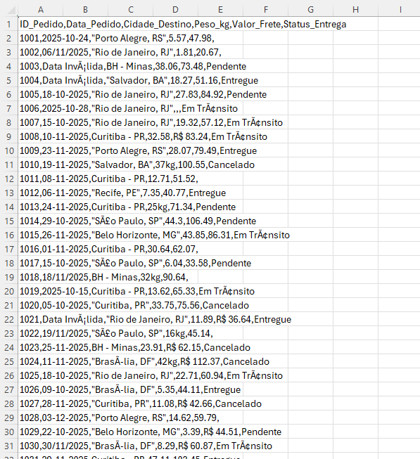

# 🚚 Automação de ETL para Logística com Python

## 📋 Resumo
Script ETL (Extract, Transform, Load) em Python que automatiza a limpeza de dados logísticos brutos (CSV) e exporta relatórios padronizados para Excel/BI, eliminando o trabalho manual de tratamento de planilhas.

## 💼 O Problema de Negócio
Na rotina de logística, é comum recebermos relatórios de transportadoras ou sistemas legados em formatos não padronizados (CSV "sujos"). Esses arquivos frequentemente apresentam:
* Erros de codificação (caracteres estranhos como `ã`).
* Colunas desformatadas (tudo na coluna A).
* Datas misturadas (formatos PT-BR e EN-US) ou inválidas.
* Inconsistências de digitação nos nomes das cidades.

O tratamento manual desses dados no Excel é demorado e sujeito a falhas humanas.

## 🎲 Simulação de Cenário (Data Mocking)
Por questões de **confidencialidade e LGPD**, não utilizei dados reais da empresa. Desenvolvi o script `gerar_dados.py` para criar uma massa de dados fictícia que simula os problemas reais enfrentados no dia a dia.

**O que o gerador faz:**
* Cria um arquivo CSV propositalmente "sujo" (`dados_logistica_brutos.csv`).
* Insere erros controlados para testar a robustez do script, como:
    * Mistura de tipos de dados (texto em coluna numérica).
    * Variações de input (ex: "sao paulo", "SÃO PAULO", "SP").
    * Erros de separador CSV.

## 🛠 Como o Projeto foi Construído
O desenvolvimento seguiu um fluxo lógico de Engenharia de Dados:

1.  **Mapeamento:** Identifiquei os padrões de erro nos relatórios recebidos.
2.  **Configuração do Ambiente:** Utilizei o **VS Code** e criei um ambiente virtual Python, instalando as bibliotecas `pandas` (para análise) e `openpyxl` (para exportação Excel).
3.  **Engenharia do Caos:** Criei o gerador de dados para replicar as falhas comuns em um ambiente controlado.
4.  **Pipeline ETL (`etl_logistica.py`):**
    * **Extração:** Leitura robusta com `pandas`, tratando erros de encoding UTF-8 e separadores.
    * **Transformação:** Limpeza de strings (remoção de R$, kg), conversão de datas com tratamento de exceção (`errors='coerce'`) e padronização de cidades via dicionário (De/Para).
    * **Carga:** Exportação para `.xlsx` formatado utilizando a engine `openpyxl`.
5.  **Validação:** Comparação do output final com os dados brutos para garantir integridade.

## 📂 Estrutura do Projeto

O repositório está organizado da seguinte forma:

    📁 projeto-etl-logistica
    │
    ├── 📄 etl_logistica.py            # Script principal (Lê o bruto -> Salva o limpo)
    ├── 📄 gerar_dados.py              # Script auxiliar (Gera o CSV com erros para teste)
    ├── 📄 dados_logistica_brutos.csv  # Arquivo de entrada (Input gerado)
    └── 📊 tabela_logistica_limpa.xlsx # Arquivo final processado (Output)

## 🚀 Tecnologias Utilizadas
* **Python 3.x**
* **Pandas** (Manipulação e tratamento de dados)
* **OpenPyXL** (Exportação para Excel)
* **VS Code** (IDE)

## 📊 Resultados Visuais

Abaixo, a comparação entre o arquivo recebido (CSV Bruto) e o arquivo processado pelo script Python (Excel Limpo).

| ❌ Antes (CSV Sujo) | ✅ Depois (Excel Limpo) |
| :---: | :---: |
| Dados desformatados, encoding quebrado e texto misturado. | Colunas separadas, datas corrigidas e cidades padronizadas. |
|  |  |

> *Nota: As imagens acima demonstram o funcionamento do script rodando localmente.*

## ⚙️ Como Rodar

## ⚙️ Como Rodar

1.  **Clone o repositório:**
    ```bash
    git clone (https://github.com/rhaycosta/Automacao-de-ETL-para-Logistica-com-Python)
    ```
2.  **Instale as dependências:**
    ```bash
    pip install pandas openpyxl
    ```
3.  **Gere os dados de teste:**
    ```bash
    python gerar_dados.py
    ```
4.  **Execute o ETL:**
    ```bash
    python etl_logistica.py
    ```
    *O arquivo `tabela_logistica_limpa.xlsx` será criado na pasta.*
